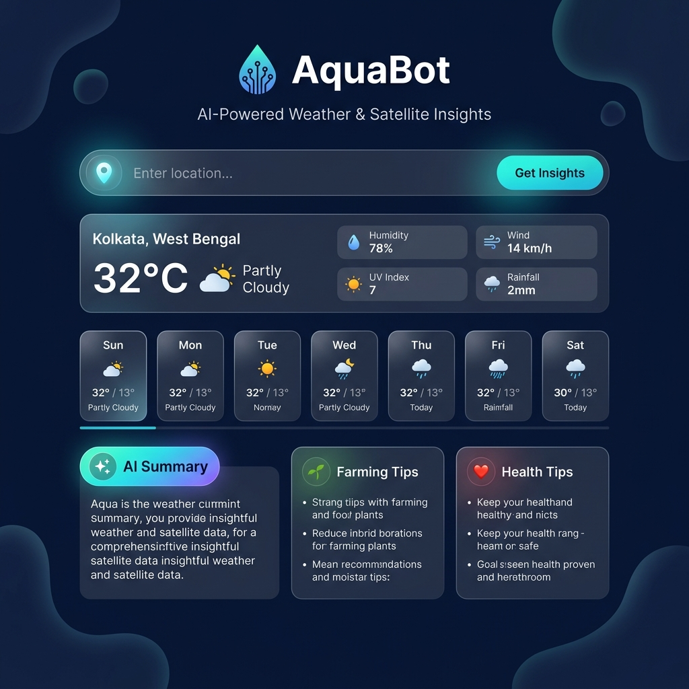

# 🌊 AquaBot — AI Weather & Satellite Insights

> **AI-powered weather intelligence for farming and health — for any city, village, or district worldwide.**

AquaBot is a FastAPI backend application that combines real-time weather data from [Open-Meteo](https://open-meteo.com/) with AI-generated insights powered by [Qwen 2.5-32B](https://huggingface.co/Qwen/Qwen2.5-32B-Instruct) via HuggingFace, delivering actionable farming and health tips for any location on Earth.

---

## 📸 Screenshots



---

## ✨ Features

- 🔍 **Global Location Search** — Resolves cities, villages, and rural areas using Open-Meteo geocoding with an OpenStreetMap/Nominatim fallback
- 🌡️ **Real-Time Weather** — Temperature, feels-like, humidity, wind, UV index, and precipitation via Open-Meteo
- 📅 **7-Day Forecast** — Daily forecast strip with min/max temperatures and descriptions
- 🤖 **AI Insights** — Weather summaries, farming tips, and health tips powered by Qwen 2.5-32B on HuggingFace
- ⚠️ **Smart Alerts** — Automatic delta-score alerts when significant weather changes are detected
- 🌱 **Rule-Based Fallback** — Works without an API token using a built-in rule engine
- 🗺️ **Interactive Map** — Leaflet.js map that centers on the searched location
- 🐳 **Docker + Cloud Run Ready** — Production Dockerfile included, built for Google Cloud Run

---

## 🏗️ Tech Stack

| Layer | Technology |
|---|---|
| **Backend** | Python 3.11, FastAPI, Uvicorn |
| **Weather API** | Open-Meteo (free, no key needed) |
| **Geocoding** | Open-Meteo Geocoding + Nominatim fallback |
| **AI Model** | Qwen/Qwen2.5-32B-Instruct via HuggingFace Inference API |
| **Frontend** | Vanilla HTML/CSS/JS, Leaflet.js, Lucide Icons |
| **HTTP Client** | HTTPX (async) |
| **Deployment** | Docker, Google Cloud Run |

---

## 🚀 Getting Started

### Prerequisites

- Python 3.11+
- A [HuggingFace account](https://huggingface.co/settings/tokens) (free, for AI features)

### 1. Clone the Repository

```bash
git clone https://github.com/Anubhab912/Aquabot.git
cd Aquabot
```

### 2. Set Up Environment

```bash
# Create and activate a virtual environment
python -m venv venv
venv\Scripts\activate      # Windows
# source venv/bin/activate  # Linux/macOS

# Install dependencies
pip install -r requirements.txt
```

### 3. Configure Environment Variables

```bash
# Copy the example file
copy .env.example .env
```

Open `.env` and fill in your token:

```env
HF_API_TOKEN=hf_your_token_here
```

> **Note:** If `HF_API_TOKEN` is left empty, AquaBot will use its built-in rule-based engine — no AI key required to run the app.

### 4. Run Locally

```bash
uvicorn main:app --reload --port 8000
```

Open your browser at **http://localhost:8000**

---

## 🐳 Docker

### Build & Run

```bash
docker build -t aquabot .
docker run -p 8080:8080 --env-file .env aquabot
```

### Google Cloud Run

```bash
gcloud run deploy aquabot \
  --source . \
  --region asia-south1 \
  --allow-unauthenticated \
  --set-env-vars HF_API_TOKEN=your_token_here
```

---

## 📡 API Endpoints

| Method | Endpoint | Description |
|---|---|---|
| `GET` | `/` | Serves the frontend UI |
| `GET` | `/health` | Health check — returns `{"status": "ok"}` |
| `GET` | `/geocode?city={name}` | Resolves a location name to lat/lon |
| `GET` | `/weather?city=&lat=&lon=` | Fetches weather + AI insights |

### Example: `/weather`

```
GET /weather?city=Kolkata&lat=22.5726&lon=88.3639
```

**Response:**
```json
{
  "context": {
    "city": "Kolkata, West Bengal, India",
    "temperature_c": 32.1,
    "feels_like_c": 38.4,
    "humidity_pct": 78,
    "wind_kmh": 14,
    "uv_index": 7,
    "precipitation_mm": 2.0,
    "weather_description": "Partly Cloudy",
    "season": "Summer"
  },
  "insights": {
    "summary": "It's a hot and humid day in Kolkata...",
    "farming_tips": ["Water crops early morning...", "..."],
    "health_tips": ["Apply SPF 30+ sunscreen...", "..."],
    "model_used": "Qwen2.5-32B-Instruct",
    "alert": null
  }
}
```

---

## 📁 Project Structure

```
Aquabot/
├── main.py             # FastAPI app, routes, geocoding logic
├── weather.py          # Open-Meteo weather fetching & parsing
├── ai_engine.py        # HuggingFace AI insight generation + fallback
├── alert.py            # Delta-score weather alert system
├── models.py           # Pydantic data models
├── wmo_codes.py        # WMO weather code → description mapping
├── requirements.txt    # Python dependencies
├── Dockerfile          # Production Docker image
├── .env.example        # Environment variable template
├── screenshots/        # App screenshots
└── static/
    ├── index.html      # Frontend UI
    ├── style.css       # Glassmorphism dark theme styles
    └── app.js          # Frontend logic (geocoding, rendering)
```

---

## 🔒 Security

- `.env` is **gitignored** — your API token is never committed.
- The Docker image runs as a **non-root user** (`appuser`) for security.
- Use `.env.example` as a safe template to share configuration requirements.

---

## 📄 License

This project is open source. Feel free to fork and build on it.

---

## 🙏 Acknowledgements

- [Open-Meteo](https://open-meteo.com/) — Free weather & geocoding API
- [HuggingFace](https://huggingface.co/) — AI model hosting
- [Qwen by Alibaba Cloud](https://huggingface.co/Qwen) — Qwen2.5-32B-Instruct model
- [OpenStreetMap / Nominatim](https://nominatim.openstreetmap.org/) — Geocoding fallback
- [Leaflet.js](https://leafletjs.com/) — Interactive maps
- [Lucide Icons](https://lucide.dev/) — Icon library
